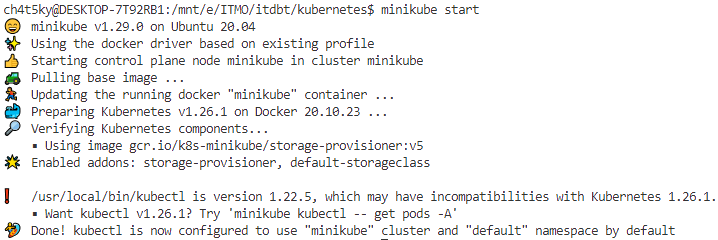
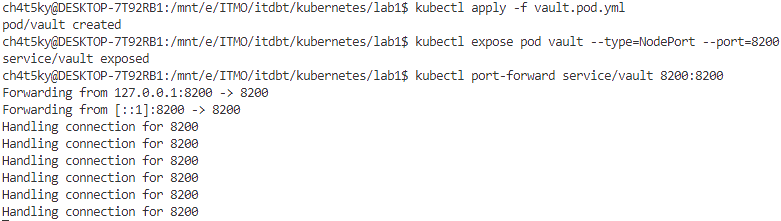
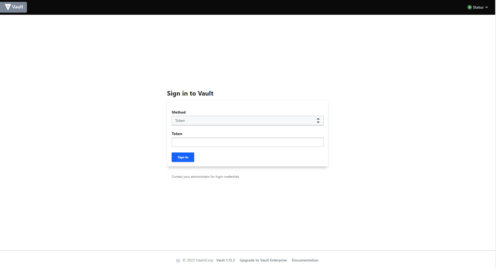
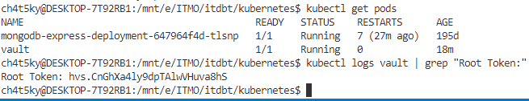
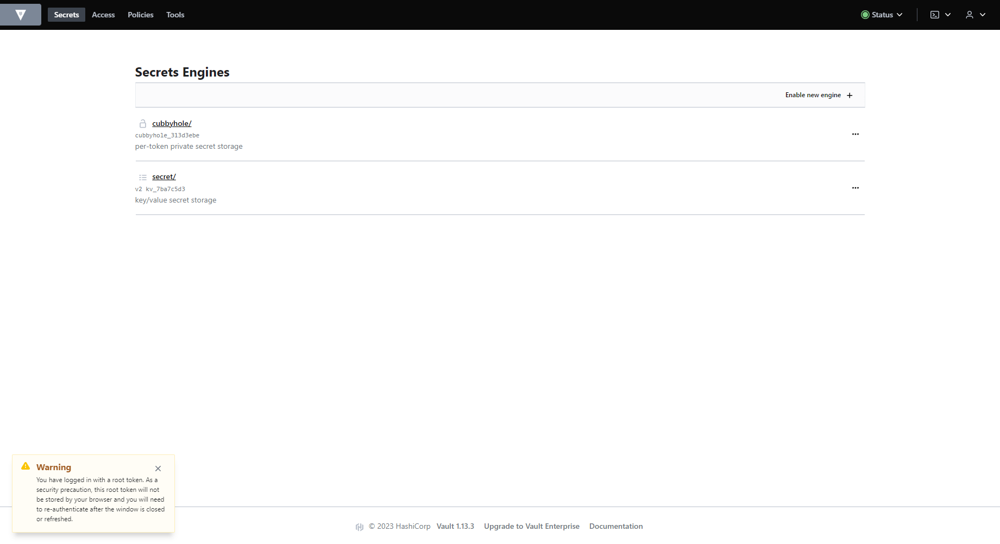
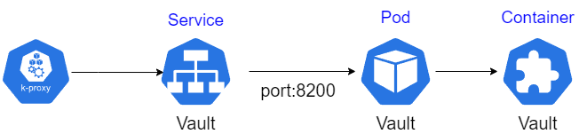

# Лабораторная работа №1 "Установка Docker и Minikube, мой первый манифест."

## Содержание

- [Содержание](#содержание)
- [Введение](#введение)
- [Ход работы](#ход-работы)
  - [Установка Docker/Minikube](#установка-dockerminikube)
  - [Создание пода](#создание-пода)
  - [Получение токен](#получение-токена)
- [Cхема](#схема)

## Введение

**Цель работы**: \
Ознакомиться с инструментами Minikube и Docker, развернуть свой первый "под".
**Задачи** \

- Установить Docker/Minikube
- Создать под Vault и получить к нему доступ к контейнеру
- Найти сгенерированный Root токен, чтобы получить доступ к Vault

## Ход работы

### Установка Docker/Minikube

Для выполнения данной лабораторной работы использовался уже установленный Docker Desktop для Windows. \
Помимо этого также был настроен WSL, в котором был установлен minikube.

### Создание пода

Для создания пода был создан манифест, который можно найти в файле **vault.pod.yaml**.
После этого был создан сервис для доступа к контейнеру, а также прокинут порт на **127.0.0.1:8200**.

Выполнив все команды, был получен доступ к Vault UI.

### Получение токена

Root токен от Vault находится в логах, поэтому необходимо получить их из контейнера. 
Для этого надо получить список подов, скопировать имя пода, а потом запросить логи и найти строчку **Root Token**.

Скопируем данный токен и вставим в форму, тем самым получив доступ к функциональности Vault.

## Схема

