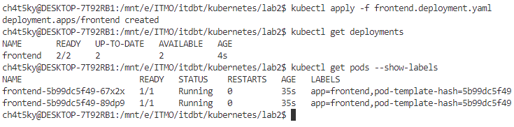
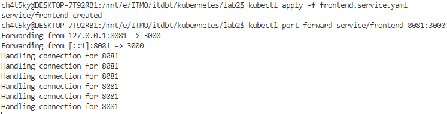
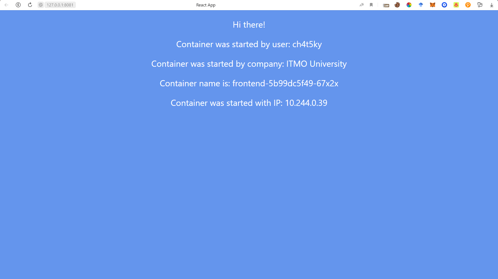
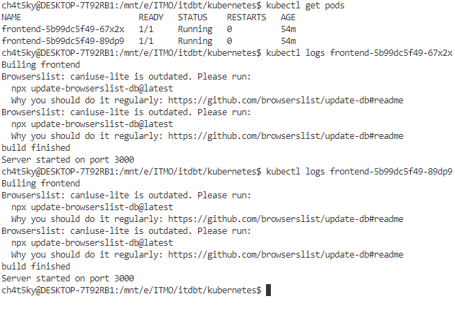
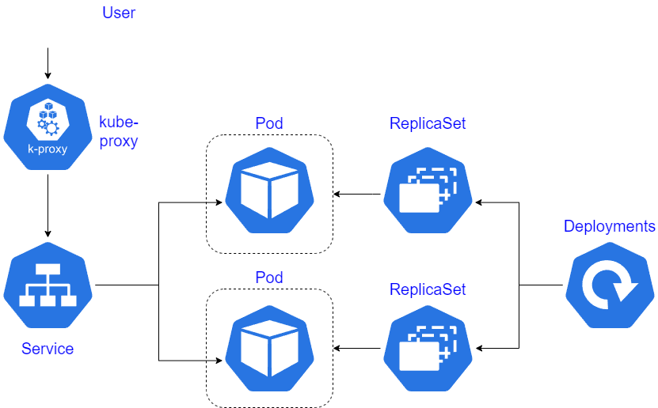

University: [ITMO University](https://itmo.ru/ru/) \
Faculty: [FICT](https://fict.itmo.ru) \
Course: [Introduction to distributed technologies](https://github.com/itmo-ict-faculty/introduction-to-distributed-technologies) \
Year: 2023/2024 \
Group: K4111с \
Author: Zaglubotskii Artem Valerevich \
Lab: Lab2 \
Date of create: 05.10.2023 \
Date of finished: <none>

# Лабораторная работа №2 "Развертывание веб сервиса в Minikube, доступ к веб интерфейсу сервиса. Мониторинг сервиса."

## Содержание

- [Содержание](#содержание)
- [Введение](#введение)
- [Ход работы](#ход-работы)
  - [Создание Deployment](#создание-deployment)
  - [Создание Service](#создание-service)
- [Cхема](#схема)

## Введение

**Цель работы:** \
Ознакомиться с типами "контроллеров" развертывания контейнеров, ознакомится с сетевыми сервисами и развернуть свое веб приложение. \
**Задачи:**

- Создать Deployment с 2 репликами контейнера  ifilyaninitmo/itdt-contained-frontend:master и передать переменные в эти реплики: REACT_APP_USERNAME, REACT_APP_COMPANY_NAME
- Создать сервис через который у вас будет доступ на эти "поды".
- Запустить в minikube режим проброса портов и подключитесь к вашим контейнерам через веб браузер.
- Проверить на странице в веб браузере переменные REACT_APP_USERNAME, REACT_APP_COMPANY_NAME и Container name. Изменяются ли они? Если да то почему?

## Ход работы

### Создание Deployment

Для создания deployment был написан манифест, который можно найти в файле **frontend.deployment.yml**.

### Создание Service

Для создания service был написан манифест, который можно найти в файле **frontend.service.yml**, а также был проброшен порт наружу.

Сервисы могут быть 4 типов:

- **ClusterIP**: присваивает IP в сервисной сети, который доступен только внутри кластера.
- **NodePort**: предоставляет порт на внешнем ip самого узла (ноды), сервис будет доступен из вне по выделенному порту на каждой ноде. При этом создается и внутренний сервис ClusterIP.
- **LoadBalancer**: используется для внешних облачных балансировщиков. Сервис будет доступен через внешний балансировщик провайдера, при этом создаются NodePort с портами, куда будет приходить трафик от провайдера и ClusterIP.
- **ExternalName**: cопоставляет сервис с содержимым поля Host (например foo.bar.example.com), возвращая запись CNAME с ее значением.

### Приложение

При подключении к приложении по адресу: **127.0.0.1:8081** нам возвращается следующая страница:

При обновлении страницы, параметры не изменяются, потому что команда берет только одну реплику и придерживается её. \
Получим логи от веб-сервисов, получив список подов, а потом запросив логи из них:

## Схема

