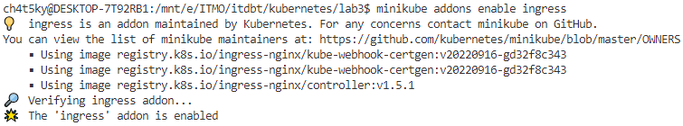
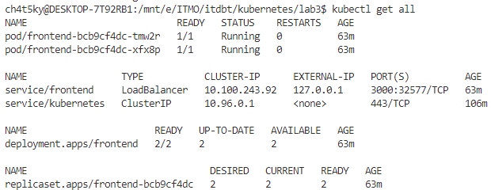
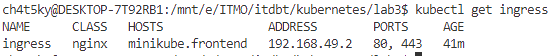
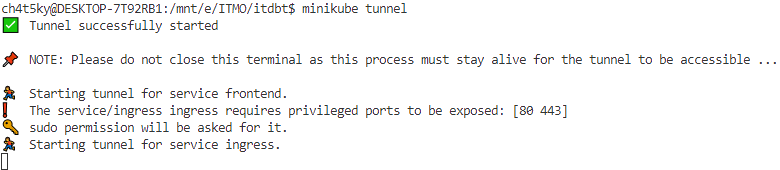
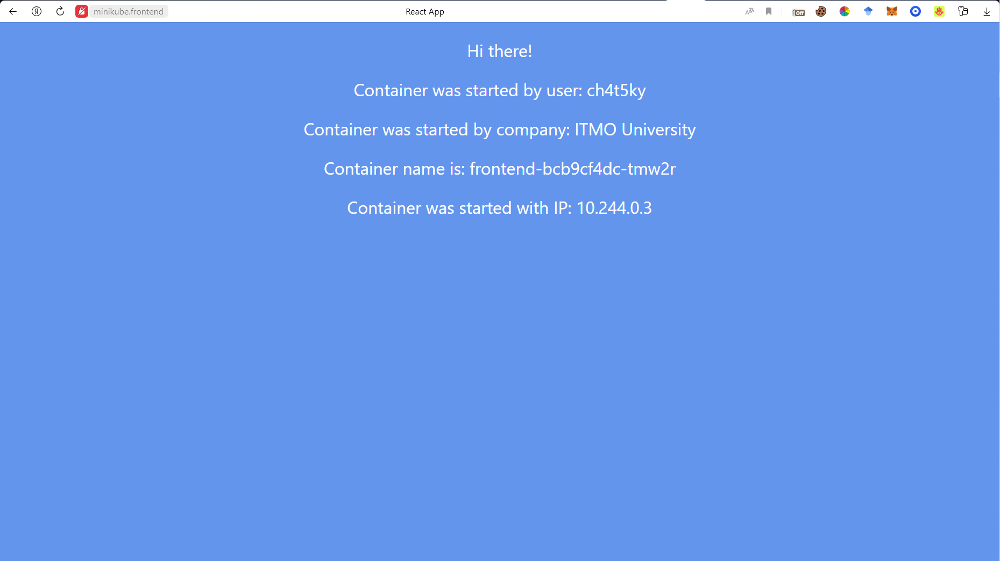
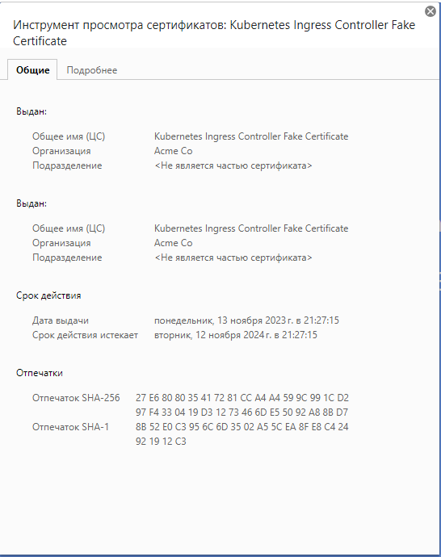
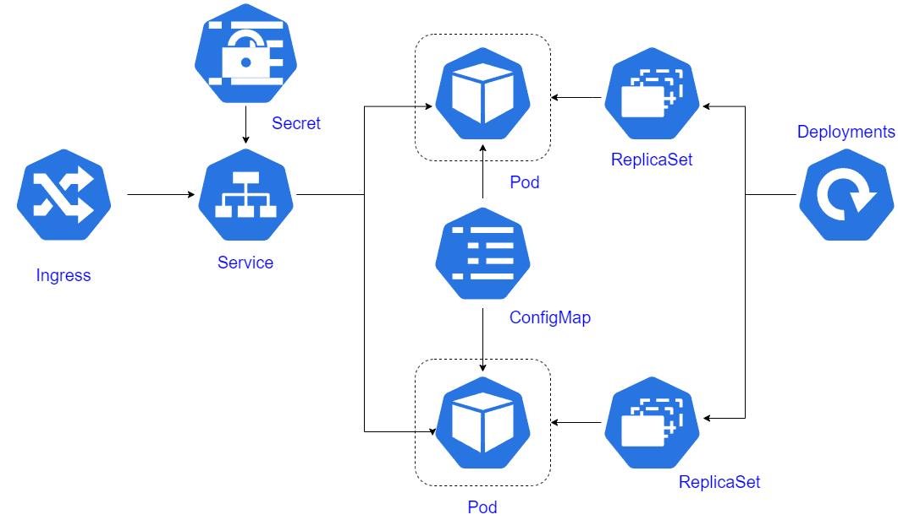

University: [ITMO University](https://itmo.ru/ru/) \
Faculty: [FICT](https://fict.itmo.ru) \
Course: [Introduction to distributed technologies](https://github.com/itmo-ict-faculty/introduction-to-distributed-technologies) \
Year: 2023/2024 \
Group: K4111с \
Author: Zaglubotskii Artem Valerevich \
Lab: Lab1 \
Date of create: 13.11.2023 \
Date of finished: <none>

# Лабораторная работа №3 "Сертификаты и "секреты" в Minikube, безопасное хранение данных."

## Содержание

- [Содержание](#содержание)
- [Введение](#введение)
- [Ход работы](#ход-работы)
  - [Создание ConfigMap](#создание-configmap)
  - [Создание Секретов](#создание-секретов)
  - [Ingress](#ingress)
  - [Приложение](#приложение)
- [Cхема](#схема)

## Введение

**Цель работы:** \
Познакомиться с сертификатами и "секретами" в Minikube, правилами безопасного хранения данных в Minikube. \
**Задачи:**

- Создать configMap с переменными: REACT_APP_USERNAME, REACT_APP_COMPANY_NAME
- Создать replicaSet с 2 репликами контейнера ifilyaninitmo/itdt-contained-frontend:master и используя ранее созданный configMap передать переменные REACT_APP_USERNAME, REACT_APP_COMPANY_NAME
- Включить minikube addons enable ingress и сгенерировать TLS сертификат, импортировать сертификат в minikube
- Создать ingress в minikube, где указан ранее импортированный сертификат, FQDN по которому вы будете заходить и имя сервиса который вы создали ранее


## Ход работы

### Создание ConfigMap

ConfigMap - это API-объект, который используется для хранения неконфеденциальной информации в виде пары ключ-значение. \
Pod-ы могути принимать ConfigMap как переменные окружения, консольные аргументы или как конфигурационные файлы в volume.

Пример создания configMap находится в файле **configmap.yml**

Использование configMap в deployment можно найти в файле **deployment.yaml**. 

### Создание секретов

Secrets - это объект, который содержит конфиденциальную информацию, такую как пароль, токен или ключ. 

Для генерации TLS сертификата необходимо выполнить следующую команду:

```bash
openssl req -x509 -nodes -newkey rsa:2048 -keyout lab3.key -out lab3.crt
```

Чтобы добавить сертификат в качестве секрета, необходимо выполнить следующую команду:

```bash
kubectl create secret tls tls-secret --cert=lab3.crt --key=lab3.key
```

### Ingress

Ingress - это API-объект, который управляет внешним доступом к сервисам в кластере, обычно по HTTP.
Ingress предоставляет балансировку нагрузки,  именованные виртуальные хосты, а также работу с SSL.

Чтобы в minikube можно было использовать Ingress, небходимо подключить данный аддон с помощью команды:

```bash
minikube addons enable ingress
```



Пример конфигурации Ingress представлен в файле **ingress.yaml**.

Результат:





### Приложение

Чтобы использовать FQDN необходимо прокинуть тоннель в кластер с помощью команды



После этого, необходимо в файл hosts добавить запись о том, что данному FQDN соответствует IP адрес minikube.

При подключении к приложении по адресу: **https://minikube.frontend** нам возвращается следующая страница:



Также можем увидеть, что сертификат подсвечен как недоверенный и можно посмотреть как он выглядит.



## Схема

