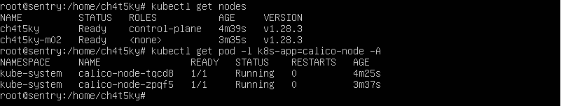
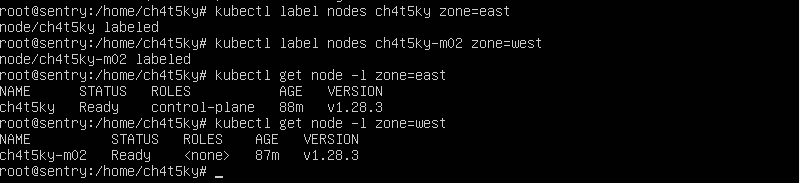
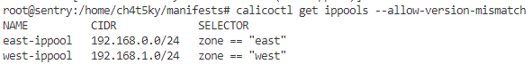
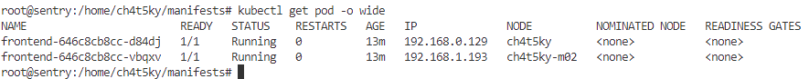
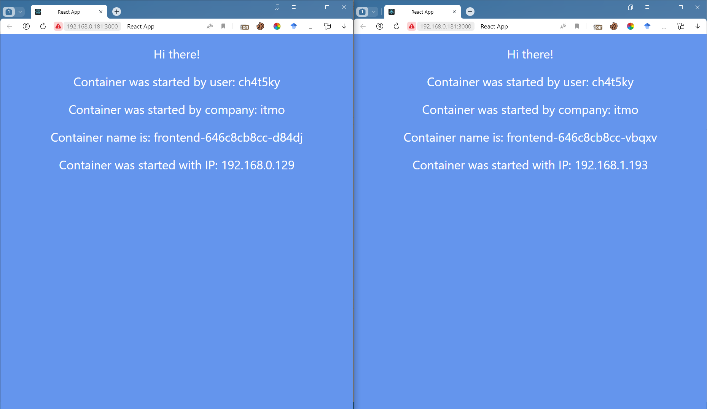
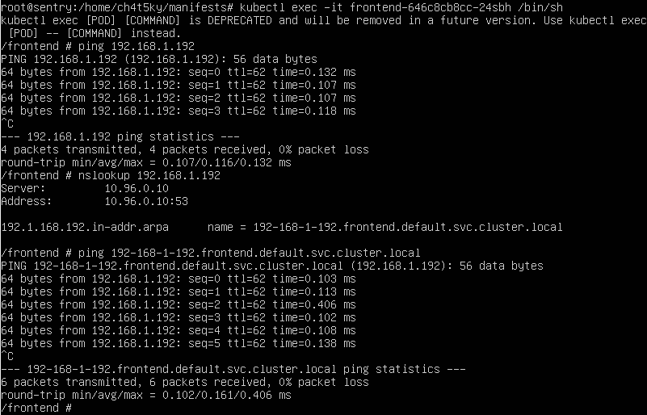
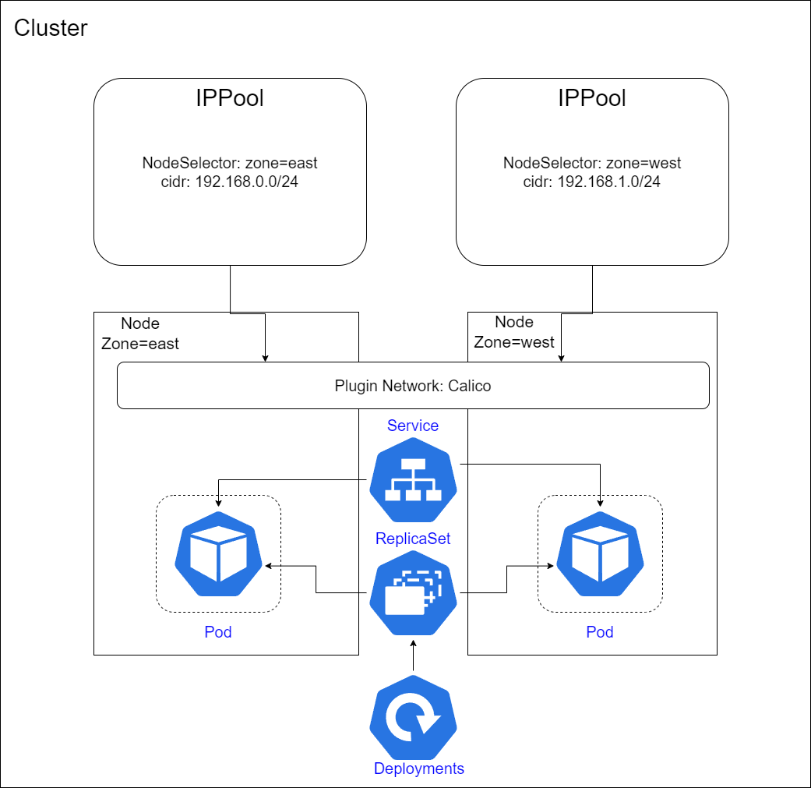

University: [ITMO University](https://itmo.ru/ru/) \
Faculty: [FICT](https://fict.itmo.ru) \
Course: [Introduction to distributed technologies](https://github.com/itmo-ict-faculty/introduction-to-distributed-technologies) \
Year: 2023/2024 \
Group: K4111с \
Author: Zaglubotskii Artem Valerevich \
Lab: Lab4 \
Date of create: 29.11.2023 \
Date of finished: <none>

# Лабораторная работа №4 "Сети связи в Minikube, CNI и CoreDNS"

## Содержание

- [Содержание](#содержание)
- [Введение](#введение)
- [Ход работы](#ход-работы)
  - [Плагин Calico](#плагин-calico)
  - [Режим IPAM](#режим-ipam)
  - [Развертывание приложений](#развертывание-приложений)
- [Cхема](#схема)

## Введение

**Цель работы:** \
Познакомиться с CNI Calico и функцией IPAM Plugin, изучить особенности работы CNI и CoreDNS. \
**Задачи:**

- Установить плагин `CNI=calico` и режим работы `Multi-Node-Clusters`
- Использовать `IPAM Plugin` для проверки работы Calico
- Указать для нод  `label` по признаку стойки или географического расположения
- Разработать манифест, который на основе меток назначал бы IP адреса подам
- Создать deployment с 2 репликами контейнера ifilyaninitmo/itdt-contained-frontend:master и используя ранее созданный configMap передать переменные REACT_APP_USERNAME, REACT_APP_COMPANY_NAME
- Создать сервис через которыйбудет доступ на эти "поды".
- Подключиться к контейнерам и проверить через веб-браузер их `Container name` и `Container IP`
- Пропинговать сторонний под по его FQDN

## Ход работы

### Плагин Calico


Для выполнения задания необходимо использовать CNI плагин Calico, а также запустить minikube с двумя нодами.

```bash
minikube start --network-plugin=cni --cni=calico --nodes 2 -p ch4t5ky
```

Чтобы проверить состояние кластера необходимо выполнить следующие команды:

```bash
kubectl get nodes
kubectl get pod -l k8s-app=calico-node -A
```



### Режим IPAM

Для использования режима IPAM создаем для каждой ноды label следующим образом:

```bash
kubectl label nodes {node_name} {label_name}={label_value}
```



Чтобы создать IPpool необходимо написать манифест, со следующей конфигурацией:

```yaml
apiVersion: projectcalico.org/v3
kind: IPPool
metadata:
  name: east-ippool
spec:
  cidr: 192.168.0.0/24
  ipipMode: Always
  natOutgoing: true
  nodeSelector: zone == "east"
---
apiVersion: projectcalico.org/v3
kind: IPPool
metadata:
  name: west-ippool
spec:
  cidr: 192.168.1.0/24
  ipipMode: Always
  natOutgoing: true
  nodeSelector: zone == "west"
```

После этого необходимо выполнить следующую команду:

```bash
calicoctl create -f ippool.yaml
```



### Развертывание приложений

Для тестирования работы деплойментов использовался манифест из лабораторной работы №3, который был видоизменен и создан в виде одного файла `deployment.yaml`.



После того, как были запущены сервисы, а также прокинут доступ до них при заходе в браузер можно увидеть изменение подов, так как был выбран LoadBalancer:



Подключимся к одному из подов и попробуем пропинговать другой, используя FQDN или IP. Для этого используется следующая команда:

```bash
kubectl exec -it {pod} /bin/sh
```



## Схема


